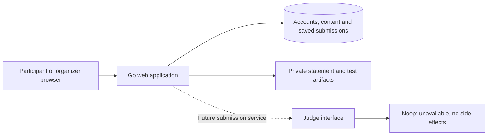

# Cotests architecture proposal

Updated: 2026-09-08. Cotests is a remake of ZawodyWeb with additional functionality.

**The judge currently consists only of an interface and Noop. Its design is deferred to the user and professor.** [JUDGE.md](JUDGE.md) supersedes the previous worker/sandbox/queue proposals.

Release definitions: [ROADMAP.md](ROADMAP.md), [MVP.md](MVP.md), [FEATURE_PARITY.md](FEATURE_PARITY.md). Implemented findings and fixes: [CODE_REVIEW.md](CODE_REVIEW.md).

## Product direction and scope

Preserve ZawodyWeb's contest, authoring and participant workflows while improving usability and maintainability. Build the web application independently from the judging engine.

The current MVP supports authoring and collecting submissions. Saved code remains unjudged; result-dependent views explicitly state their unavailable status. It does not run a graded contest.

Keep the user-facing hierarchy **Contest → Series → Problem**. Separate reusable problem identity from its assignment to a contest so that later cloning, reuse and revision history remain manageable.

The first installation is assumed to serve one institution. Enrollment, account roles, privacy and artifact access are application responsibilities. Engine behavior, scoring and result delivery remain open until the joint design.

## Stack

| Area | Decision now | Later decision |
| --- | --- | --- |
| Web | Keep Go, chi, html/template and go:embed | No framework rewrite planned. |
| Browser | Keep HTMX and small JavaScript modules | No result polling while the judge is unavailable. |
| Style | Keep The Digital Atelier and CSS tokens | Extract repeated layouts and verify accessibility/mobile flows incrementally. |
| Data layer | Keep GORM, SQLite, optional PostgreSQL and versioned migrations | Run the opt-in PostgreSQL integration check against each supported deployment. |
| SQLite | Enable foreign keys through the DSN on every connection; keep the existing single-connection pool | Tune WAL/concurrency only against deployment needs. |
| Files | Plan private filesystem artifacts plus DB metadata/hashes | Object storage or a bounded BLOB backend can be considered separately. |
| Auth | Keep opaque cookie sessions and bcrypt | Operator bootstrap, throttling, recovery and scoped membership are foundation work. |
| Judge | Implement only the provisional Judge interface and Noop returning ErrUnavailable | Engine, runner, protocol, queue, checkers, languages, metrics and scoring are professor-led design. |
| Operations | Web configuration, migrations, backups and request/storage limits | Judge deployment and operational controls wait for its design. |

The web application remains a single Go binary with embedded UI. No compiler, container runtime, separate worker or judge dependency is required by the current implementation or web MVP.

GORM remains the query layer. Schema changes are explicit, ordered migrations recorded in `schema_migrations`; add a new immutable migration for every future schema change.

SQLite foreign-key setup is now applied per connection using the pinned driver's DSN support. Existing caller options are retained, with the required FK pragma appended last. [Driver configuration](https://github.com/glebarez/sqlite#foreign-key-constraint-activation)

## Application boundary



The package exists today; the submission service shown in the diagram is future work. It is not wired into a route because submissions do not yet exist.

The application will save source independently of a judging request. Noop returns ErrUnavailable, and the application retains the source with an unjudged status. There is no hidden queue, retry loop, background execution, result callback or mock grader.

Do not populate verdict, score, runtime or memory with default “results”. Zero points implies grading took place; absent points means no result exists. Ranked results and rejudge actions remain unavailable until the real integration is designed and implemented.

## Incremental domain model

| Entity | Application responsibility |
| --- | --- |
| User / Session | Existing account/session identity. Add lifecycle and integrity improvements through migrations. |
| Contest / Series | Existing hierarchy, publication and ordering; extend with schedules, membership and access policy. |
| ContestMembership | Scoped organizer/participant authority, enrollment and later display aliases. |
| Problem | Stable reusable content identity and kind; begin with programming content. |
| ProblemRevision | Published statement, attachment/test references and grading-configuration metadata. Editing creates a new draft. |
| SeriesProblem | Assignment to a series, display code/order and ranking-inclusion metadata. |
| TestCase | Private input/answer references, sample flag, order, points metadata and optional time-limit override. |
| Artifact | Hash, byte size, type, private storage key and ownership/references. A known hash never grants access. |
| Submission | Immutable owner, source/answer, accepted timestamp, problem revision and selected language identifier; idempotency key and unjudged state. |
| Clarification | Contest question, optional problem, author, reply and public/private audience. Separate from a quiz answer. |
| AuditEvent | Actor, action, target and safe change summary for content/role/import operations. |

Do not create JudgeJob, worker, judgement or result tables merely to implement the placeholder. Their shapes and semantics depend on the professor-led design. Record source and content revisions now so future integration has a stable application record to reference.

Store durations and memory/size metadata with explicit units. Validate bounds and required fields without claiming that stored compiler/checker identifiers are executable. Published revisions are immutable; do not silently change existing submissions when an organizer edits a task.

Restrict deletion once submissions reference a problem or contest. Archive those records; hard deletion remains for unreferenced drafts. Cloning later creates independent draft metadata while immutable file bytes can be shared safely.

## Publication and authorization

Separate discovering a contest, reading its statements, submitting source and viewing results. The current active-contest-only queries still need this policy change.

Published upcoming contests may expose schedule/rules without unreleased problems. Ended contests remain discoverable according to archive policy. Store absolute time in UTC and a display timezone; use server-side half-open intervals for source submission acceptance.

Centralize resource policies for managing contests, viewing content, submitting and reading source. Apply the same rules to normal pages, HTMX fragments, PDFs, source downloads and private test files.

Begin with platform administrator, scoped organizer and participant. [AUTH.md](AUTH.md) specifies the planned lifecycle. Aliases affect display rather than account identity. Optional IP restrictions require an explicit trusted-proxy policy and do not replace membership.

Treat the original's “Classes” as executable-plugin metadata, not educational cohorts. Retain identifiers needed for import, but do not load or run those plugins.

## Files, authoring and imports

Keep uploads outside public/embedded static assets. Use generated storage keys, bounded streaming, hashes, temporary files and atomic rename. Commit metadata references after file storage succeeds and collect unreferenced files with a grace period.

Prefer readable statements plus optional PDF downloads. Sanitize rendered Markdown; do not expose imported HTML as trusted template content. PDF conversion, if later required, is separate work rather than a new executable launched during this branch.

Backups cover a consistent database snapshot and all referenced immutable artifacts. Verify a clean restore before collecting valuable source/content. Do not treat a copy of only a live SQLite main file as a complete backup design. [SQLite isolation](https://www.sqlite.org/isolation.html)

Start with manual tests and a bounded .in/.out import. Later add a versioned native manifest and a distinct adapter for ZawodyWeb's XML packages. Both feed shared validation and preview/commit logic.

Bound actual decompressed bytes and file count, reject traversal/absolute paths, symlinks and duplicate normalized names, and validate every reference. Imports do not execute checker binaries, publish content automatically or fabricate judging results.

Preserve unsupported checker/language identifiers for review. A successful content import is not evidence that its grading behavior is compatible. Inventory representative original formats early; engine compatibility is verified in J.

## Code structure

Keep the current entry point and working packages; introduce a module only when a workflow needs it.

```text
main.go                  # composition, config and embedded UI
internal/
  server/                # HTTP routes, forms, middleware and rendering
  auth/                  # existing password/security primitives
  db/                    # queries, models and future versioned migrations
  judge/judge.go         # interface and Noop only; implemented
  contest/               # future schedule/membership/publication services
  problem/               # future authoring/revision services
  submission/            # future persistence/ownership + judge boundary
  artifact/              # future private file handling
  importer/              # future native/legacy format adapters
static/                  # existing public assets and templates
```

Moving templates outside the public static subtree remains a small future cleanup. Do not scaffold empty feature packages now. Services own use-case transactions, HTTP handlers parse/render, and data access stays explicit.

Add request contexts and pagination as workflows grow. Stream large artifacts, keep transactions short and avoid loading identity for static/liveness requests. The current contest-creation response now replaces the full list to keep empty-state behavior consistent; paginate when actual volume warrants it.

Use dense tables for submission lists, readable statements and clear unavailable states. Improve existing CSS through named layout classes and semantic status tokens without replacing the design system.

## Deferred judging discussion

[JUDGE.md](JUDGE.md) lists open questions. No Linux worker, Isolate integration, job lease protocol, runtime profile, checker implementation or scoring formula is a selected architecture requirement.

Full replacement must eventually verify grading, rankings, rejudging, quizzes and required external integrations against the baseline. Until then, continue web/content work and explicitly track those engine-dependent capabilities as incomplete.
